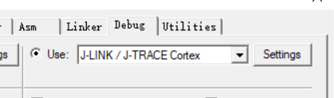
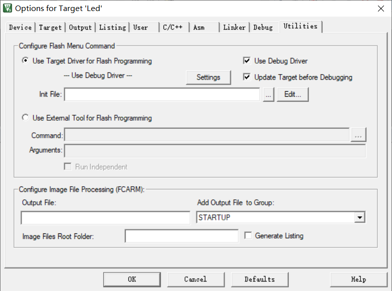
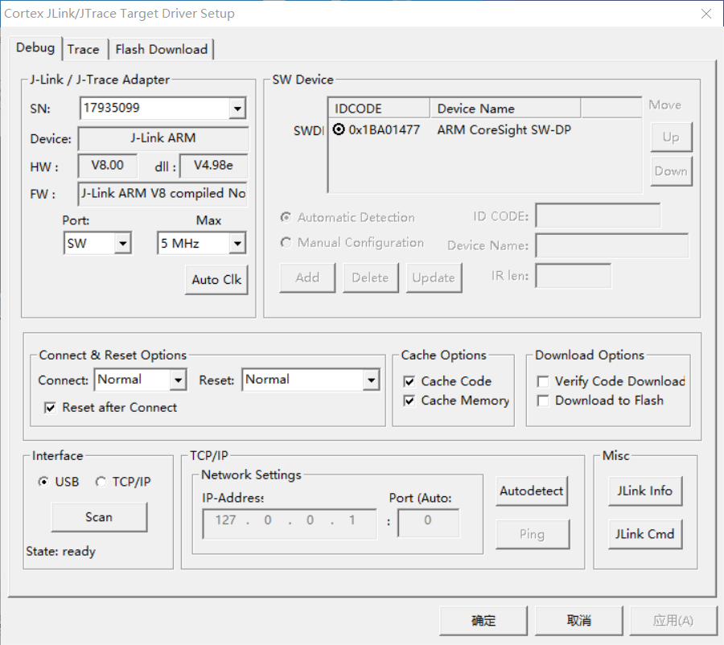
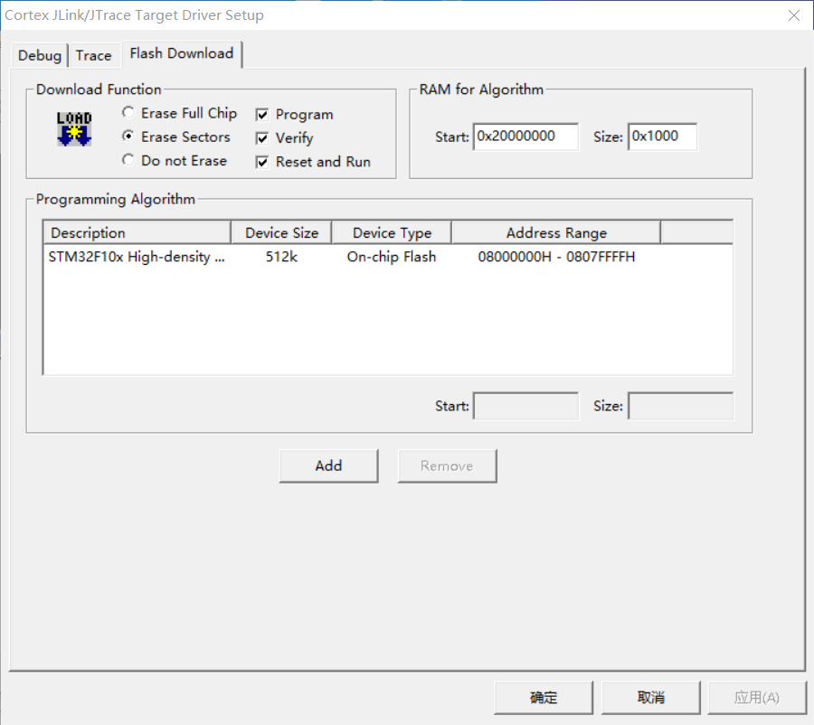
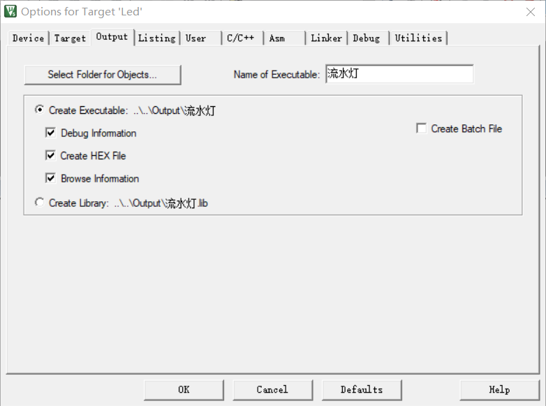

## 01_如何使用DAP仿真器下载程序

### 1.硬件连接

**电脑主机**通过usb线连接**仿真器**

**仿真器**通过排线连接**开发板**

开发板必须供电

### 2.仿真器的配置

首先要打开KEIL，在魔术棒选项卡选择仿真器的型号。

#### **1.Debug设置**

选择仿真器的型号

 

#### **2.Utilities选项配置**

Use Debug Driver 打勾

#### **3.Debug Settings选项设置**

这里也是第一步中选对了仿真器，并且安装了好了驱动会自动识别出来的。

- Port：SW
- Max：5MHz
- Reset：Normal 这里和教程不一样
- SW Device：这里是显示仿真器识别到的开发板芯片，要正确选择

#### **4.Debug Settings选项中的Flash Download**

- Erase Sectors：打勾 擦除速度快
- Reset and Run：打勾 下载完之后程序会自动运行，不用手动复位。
- Programming Algorithm：选择合适的芯片

**5.Output选项设置**

按图示的选项打勾，注意 Create HEX File hex文件在串口下载程序中起到作用。注意文件的保存位置，以便后期寻找。（Select Folder for ...文件save)

### 3.下载程序

如果前面步骤都成功了。接下来就可以把编译好的程序下载到开发板上运行。下载程序不需要其他额外的软件，直接点击KEIL中的LOAD按钮即可。

程序下载后，Build Output选项开如果打印出 Application running... 则表示程序下载成功。如果没有出现实验现象，按复位键试试。

