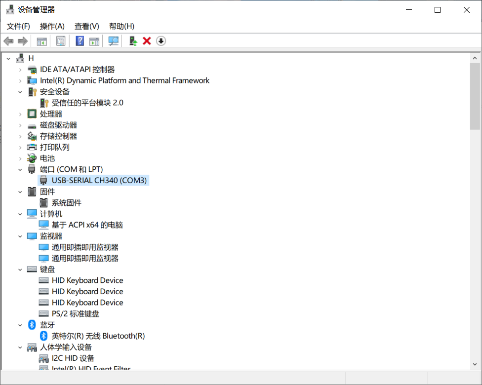

## 02_如何用串口下载程序

### 1.安装USB转串口驱动

1. 将光盘提供的**usb转串口驱动-CH340**驱动安装（A盘\4-开发软件\USB转串口驱动-CH430）

2. 用usb先和板子连接

3. 在计算机-管理-设备管理器-端口中可以识别到串口，如下图所示：

   

### 2.开始下载

1. 打开MCUISP（A盘\4-开发软件\串口下载软件）
2. 配置
   - 顶端的Port设置为上面的串口
   - bps：115200
   - 选择联机下载时的程序文件：.hex
   - 将校验和编程后执行打勾。
   - 最下面的一栏要选择：**DTR低电平复位，RTS高电平进入**bootloader
   - 最后点击开始编程。

最后效果如下：

如果hex文件选择的是灯泡闪烁的那个文件的话，那么下载成功后，灯泡会开始闪烁。