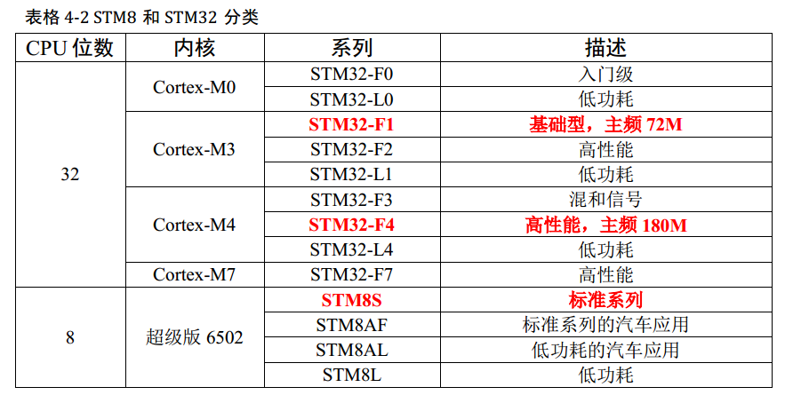
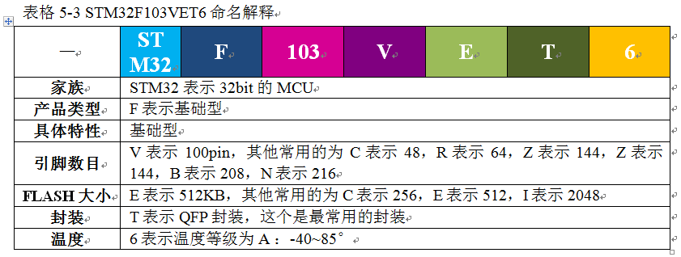

## 03_初识STM32

### 1.什么是STM32

**STM32的字面意思**

1. ST— 意法半导体，是一个公司名，即SOC厂商
2. M— Microelectronics的缩写，表示**微控制器**，大家注意微控制器和微处理器的区别
3. 32— 32bit的意思，表示这是一个32bit的**微控制器**

### 2.STM32能做什么

智能手环，微型四轴飞行器，平衡车、扫地机、移动POST机，智能电饭锅，3D打印机

### 3.STM32怎么选型

#### **STM32分类**

#### **STM32的命名方法**

