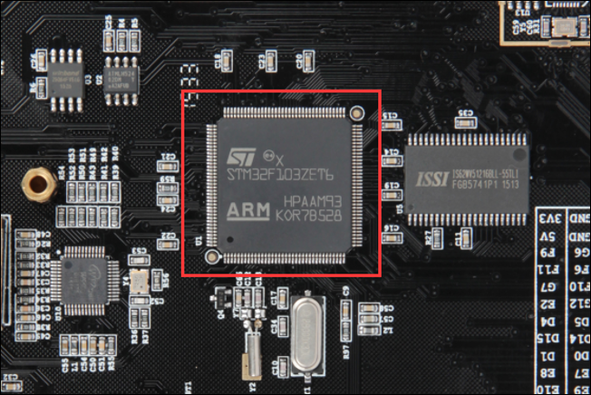

## 04_什么是寄存器

1.什么是储存器映射

2.什么是寄存器映射

### 1.STM32长什么样



#### 学会看丝印

芯片的正面是丝印。

- ST：代表公司
- ARM：表示芯片使用的是ARM内核
- STM32F103ZET6：指芯片的型号
- X：代表版本号
- 后面的字：应该是与批号有关。

#### 懂得如何辨别正方向

芯片四周是引脚，左下角的小圆点表示1脚，然后从1脚起按照逆时针的顺序排列（所有芯片的引脚顺序都是逆时针排列的）。

开发板中把芯片的引脚引出来，连接到各种传感器上，然后在 STM32 上编程（**实际就是通过程序控制这些引脚输出高电平或者低电平）来控制各种传感器工作**，通过做实验的方式来学习 STM32 芯片的各个资源。开发板是一种
评估板，板载资源非常丰富，引脚复用比较多，力求在一个板子上验证芯片的全部功能。


### 2.STM32内部有什么

STM32F103 采用的是 Cortex-M3 内核，内核即 CPU，由 ARM 公司设计。ARM 公司
并不生产芯片，而是出售其芯片技术授权。芯片生产厂商(SOC)如 ST、TI、Freescale，负
责在内核之外设计部件并生产整个芯片，这些内核之外的部件被称为核外外设或片上外设。
如 GPIO、USART（串口）、I2C、SPI 等都叫做片上外设。

STM32芯片架构简图


#### STM32F10xx系统框图


##### 1.ICode 总线

ICode 中的 I 表示 Instruction，即指令。我们写好的程序编译之后都是一条条指令，存放在 FLASH 中，内核要读取这些指令来执行程序就必须通过 ICode 总线，它几乎每时每刻都需要被使用，它是专门用来取指的。 

##### 2.驱动单元

**DCode 总线**

DCode 中的 D 表示 Data，即数据，那说明这条总线是用来取数的。我们在写程序的时候，数据有常量和变量两种，**常量就是固定不变的，用 C 语言中的 const 关键字修饰，是放到内部的 FLASH 当中的，**变量是可变的，不管是全局变量还是局部变量都放在内部的SRAM。因为数据可以被 Dcode 总线和 DMA 总线访问，所以为了避免访问冲突，在取数的时候 经过一个总线矩阵来仲裁，决定哪个总线在取数。 

**系统总线**

系统总线主要是访问外设的寄存器，我们通常说的寄存器编程，即读写寄存器都是通过这根系统总线来完成的。

**DMA 总线**

DMA 总线也主要是用来传输数据，这个数据可以是在某个外设的数据寄存器，可以在SRAM，可以在内部的 FLASH。因为数据可以被 Dcode 总线和 DMA 总线访问，所以为了避免访问冲突，在取数的时候需要经过一个总线矩阵来仲裁，决定哪个总线在取数。 

##### 3.被动单元

**内部的闪存存储器**

内部的闪存存储器即 FLASH，我们编写好的**程序**就放在这个地方。内核通过 ICode 总线来取里面的指令。 

**内部的 SRAM** 

内部的 SRAM，即我们通常说的 RAM，**程序的变量，堆栈**等的开销都是基于内部的SRAM。内核通过 DCode 总线来访问它。 

**FSMC**

FSMC 的英文全称是 Flexible static memory controller，叫灵活的静态的存储器控制器，是 STM32F10xx 中一个很有特色的外设，通过 FSMC，我们可以扩展内存，如外部的SRAM，NANDFLASH 和 NORFLASH。但有一点我们要注意的是，FSMC 只能扩展**静态的内存**，即名称里面的 S：static，不能是动态的内存，比如 SDRAM 就不能扩展。 

**AHB 到 APB 的桥**

从 AHB 总线延伸出来的两条 APB2 和 APB1 总线，上面挂载着 STM32 各种各样的特色外设。我们经常说的 GPIO、串口、I2C、SPI 这些外设就挂载在这两条总线上，**这个是我们学习 STM32 的重点**，**就是要学会编程这些外设去驱动外部的各种设备**。


### 3.存储器映射

存储器本身不具有地址信息，它的地址是由芯片厂商或用户分配，**给存储器分配地址的过程**就称为存储器映射。

如果给存储器再分配一个地址就叫存储器重映射。


### 4.寄存器映射

给已经分配好地址的有特定功能的内存单元取别名的**过程**就叫寄存器映射。

#### **让GPIOB的16个IO都输出高电平**

```c++
通过绝对地址访问内存单元
// GPIOB 端口全部输出 高电平
*(unsigned int*)(0x40010C0C) = 0xFFFF;

通过寄存器别名方式访问内存单元
// GPIOB 端口全部输出 高电平
#define GPIOB_ODR    (unsignedint*)(0x40010C0C)
* GPIOB_ODR = 0xFF;

为了方便操作，我们干脆把指针操作“*”也定义到寄存器别名里面
// GPIOB 端口全部输出 高电平
#define GPIOB_ODR   *(unsignedint*)(0x40010C0C)
GPIOB_ODR = 0xFF;
```


1.先定义**片上外设基地址**  PERIPH_BASE

2.然后加入各个**总线的地址偏移**得到 

- APB1
- APB2
- ABH

的总线地址

3.在其上加入**外设地址的偏移**得到GPIOA-G的外设地址。

4.最后在外设地址上加入**各寄存器的地址偏移**得到特定的寄存器地址。 


### 5.修改寄存器的位操作的方法

- 或运算（|）：0|0=0；1|0=1；0|1=1；1|1=1；
- 与运算（&）：0&0=0；0&1=0；1&0=0；1&1=1；
- 异或运算（^）：

#### 把变量的某位清零

```c
//定义一个变量 a = 1001 1111 b (二进制数)
unsigned char a = 0x9f;

//对 bit2 清零  bit0,1,2,3.....

a &= ~(1<<2);

//括号中的 1 左移两位，(1<<2)得二进制数：0000 0100 b
//按位取反，~(1<<2)得 1111 1011 b
//假如 a 中原来的值为二进制数： a = 1001 1111 b
//所得的数与 a 作”位与&”运算，a = (1001 1111 b)&(1111 1011 b),
//经过运算后，a 的值 a=1001 1011 b
// a 的 bit2 位被被零，而其它位不变。
```

#### 把变量的连续几位清零

```c

//若把 a 中的二进制位分成 2 个一组
//即 bit0、bit1 为第 0 组，bit2、bit3 为第 1 组，
// bit4、bit5 为第 2 组，bit6、bit7 为第 3 组
//要对第 1 组的 bit2、bit3 清零

a &= ~(3<<2*1);

//括号中的 3 左移两位，(3<<2*1)得二进制数：0000 1100 b
//按位取反，~(3<<2*1)得 1111 0011 b
//假如 a 中原来的值为二进制数： a = 1001 1111 b
//所得的数与 a 作”位与&”运算，a = (1001 1111 b)&(1111 0011 b),
//经过运算后，a 的值 a=1001 0011 b
// a 的第 1 组的 bit2、bit3 被清零，而其它位不变。

//上述(~(3<<2*1))中的(1)即为组编号;如清零第 3 组 bit6、bit7 此处应为 3
//括号中的(2)为每组的位数，每组有 2 个二进制位;若分成 4 个一组，此处即为 4
//括号中的(3)是组内所有位都为 1 时的值;若分成 4 个一组，此处即为二进制数“1111 b”

//例如对第 2 组 bit4、bit5 清零
a &= ~(3<<2*2);
```

#### 对于变量的某几位进行赋值

```c
//a = 1000 0011 b
//此时对清零后的第 2 组 bit4、bit5 设置成二进制数“01 b ”

a |= (1<<2*2);
//a = 1001 0011 b，成功设置了第 2 组的值，其它组不变
```

#### 对变量的某位取反

某些情况下，我们需要对寄存器的某个位进行取反操作，即 1 变 0 ，0 变 1，这可以直接用如下操作，其它位不变。

```c

```

