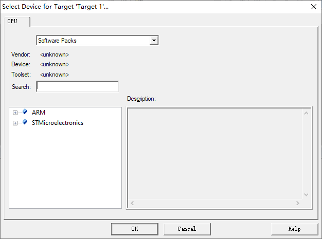

## 05_新建工程模板-寄存器版

### 1.新建工程

1. 在桌面新建一个文件夹`Template-REG`

2. 打开Keil5, 点击`Project`->`Close Project`，将现有的工程关闭。然后再新建一个工程`Project`->`New uVision Project`，打开刚刚创建的文件夹，在此文件夹下为此工程创建一个名字，如`BH-F103`点击保存。弹出一个芯片选择框：F103- “霸道”STM32F103ZE型号。

   `STMicroelectronics`->`STM32F1 Series`->`STM32F103`->`STM32F103ZE`  选择完成后点击ok

   

   点击完ok会弹出一个`Manage Run-Time Environment`点击右上角的×即可。

3. 添加文件：

   - `startup_stm32f10x_hs.s`

     - 启动文件，系统上电后第一个运行的程序，由汇编编写，C 编程用的比较少，可暂时不管，这个文件从固件库里面拷贝而来，由官方提供。这个我是在给的例程中找到的。

     - 将这个文件复制到`Template-REG`文件夹的**根目录**下，再双击Keil5中的Source Group1 将此文件添加进来。

       

   - `main.c`

     - 用户手动新建，用于存放 main 函数，暂时为空。

     - `Template-REG`文件夹的**根目录中**创建`main.c`，然后再双击Keil5中的Source Group1 将此文件添加进来。

     - 在main中写入：

       ```
       int main()
       {
           
       }
       
       ```

       **注意**：在代码的最后要加上空行，不然会有warnings，这个是keil5特有的东西。

     - 编译的时候可能会出现错误：`Undefined symbol SystemInit(referred from startup_stm32f10x_hd.o)`

       解决办法：在main下写一个函数

       ```c
       int main()
       {
           
       }
       void SystemInit()
       {
           //函数体为空，目的是为了骗过编译器不报错
       }
       ```

   - `stm32f10x.h`

     - 用户手动新建，用于存放寄存器映射的代码（用来事现寄存器定义），暂时为空。

       ```c
       #include "stm32f10x.h"
       
       int main()
       {
           
       }
       void SystemInit()
       {
           //函数体为空，目的是为了骗过编译器不报错
       }
       ```

4. 之后就是如何使用DAP仿真器下载程序的内容了。

