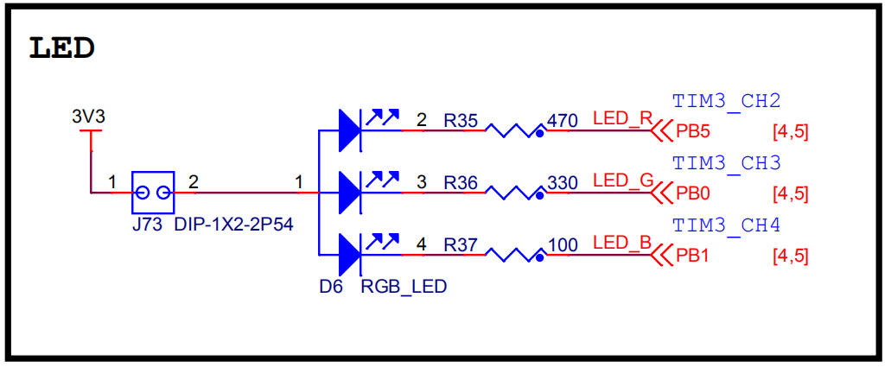
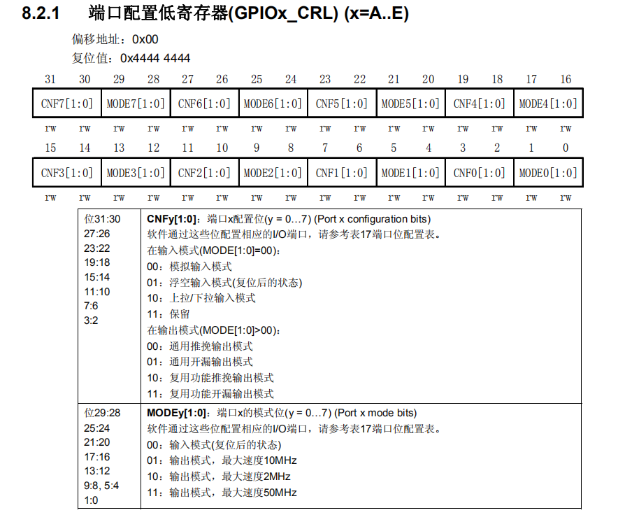
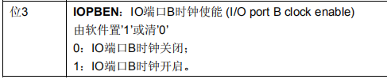

## 06_使用寄存器点亮LED灯（51）

### 1.查看开发板的原理图

野火_F103霸道\_V2



IO口有

- PB0-绿灯-下文中中要点亮的灯
- PB1-蓝灯
- PB5-红灯

**重点：**

这些IO口由**端口输出数据寄存器**（GPIOx_ODR）（x=A..E）来控制

PB0-PB15由GPIOB来控制。

### 2.配置ODR寄存器

这里是为了是PB0为低电平

**端口输出数据寄存器**（GPIOx_ODR）


在GPIOB中0DR0-ODR15分别控制PB0-PB15，所以为了控制**PB0**为低电平只需要往0DR0中写0即可。

怎么写？

```c
GPIOB_ODR &= ~(1<<0);
```

首先要找到GPIOB的地址（0X4001 0C00）然后再加上地址偏移0C，最后进行**清零操作**。

### 3.配置IO口为输出

需将PB0设置为输出口

这里将需要用到

- 端口配置低寄存器（GPIOx_CRL）---控制GPIOB的低8位 这里控制PB0故使用端口配置低寄存器即可。
- 端口配置高寄存器（GPIOx_CRH）---控制GPIOB的高8位



0-3：PB0

4-7：PB1

....

28-31：PB7

这里使CNF0=00,MODE0=01

代码怎么写？

```c
// 清空控制 PB0 的端口位
GPIOB_CRL &= ~( 0x0F<< (4*0));
// 配置 PB0 为通用推挽输出，速度为 10M
GPIOB_CRL |= (1<<4*0);
```

### 4.打开GPIOB端口的时钟

时钟由复位和时钟控制（RCC）控制。

CPIOB在APB2上，故需找到RCC_APB2ENR

IOPBEN:IO端口B时钟性能。




``` 
RCC_APB2ENR |= (1<<3);
```

