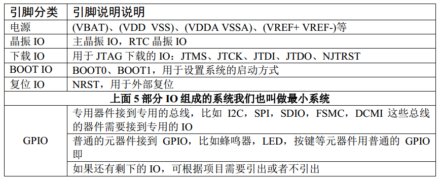
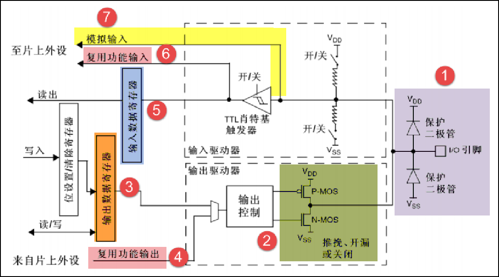
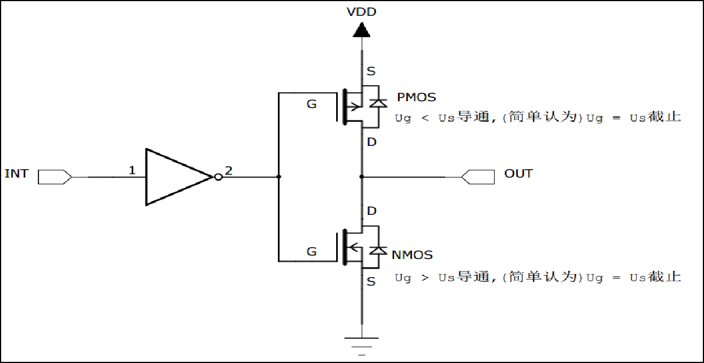
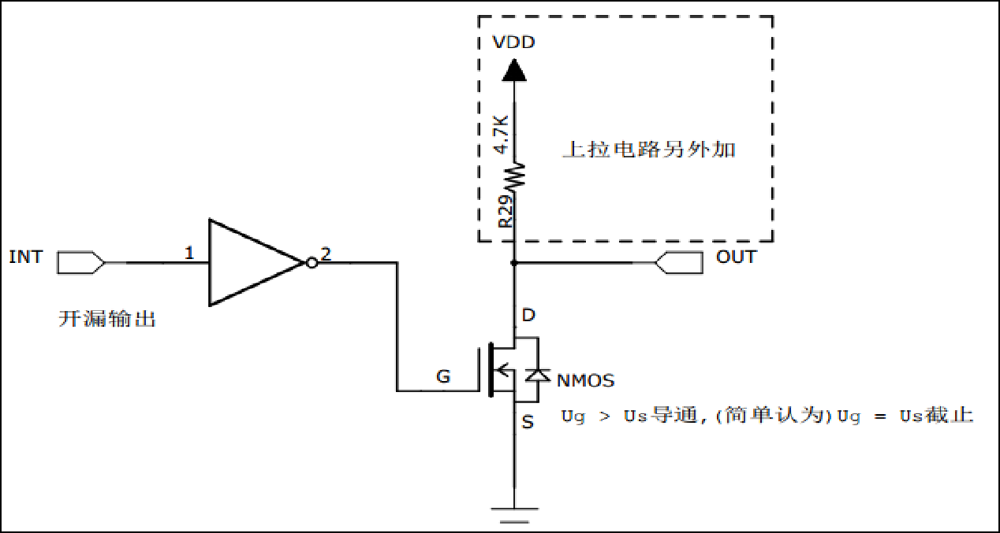
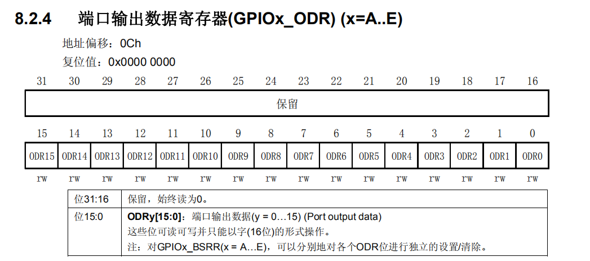
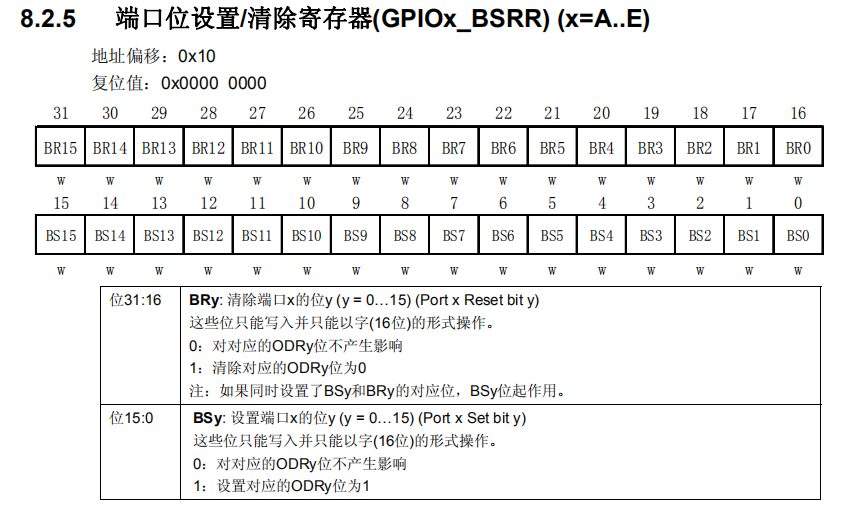
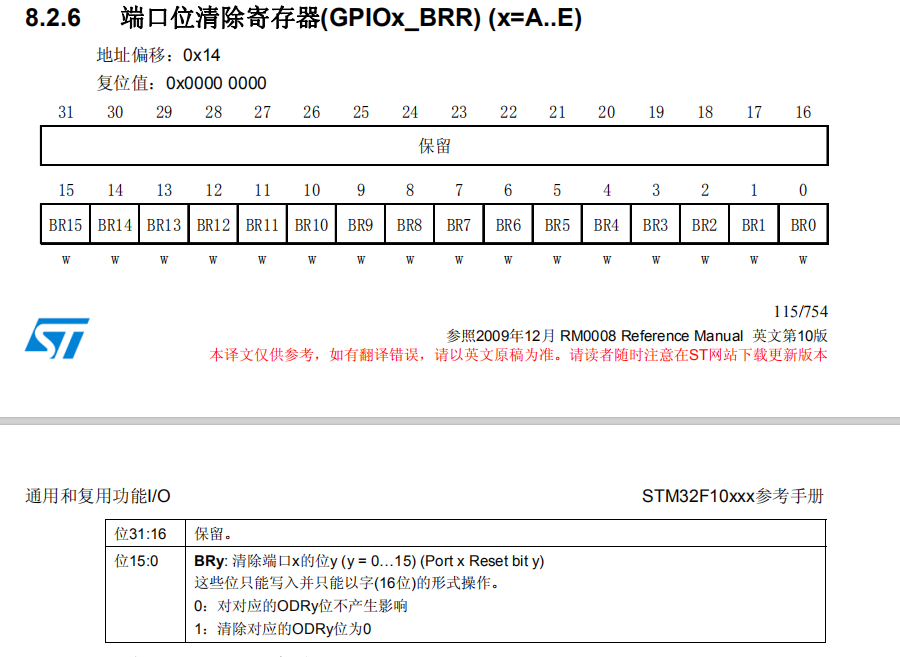

## 07_使用寄存器点亮LED灯(GPIO功能框图讲解)重点

### 1.GPIO简介

GPIO—general purpose intput output
是**通用输入输出端口**的简称，简单来说就是软件可控制的引脚，STM32芯片的GPIO引脚与外部设备连接起来，从而实现与外部通讯、控制以及数据采集的功能

GPIO 是通用输入输出端口的简称，简单来说就是 STM32 可控制的引脚，STM32 芯片的GPIO引脚与外部设备连接起来，从而实现与外部通讯、控制以及数据采集的功能。 STM32 芯片的 GPIO 被分成很多组，每组有 16 个引脚，如型号为 STM32F103ZET6 型号的 芯片有 GPIOA、GPIOB、GPIOC 至 GPIOG 共 7 组 GPIO，芯片一共 144 个引脚，其中 GPIO 就占了一大部分，所有的 GPIO 引脚都有基本的输入输出功能。

- GPIO跟引脚有什么区别？
  - 引脚包含GPIO
- 如何查找每一个GPIO的功能说明？

#### STM32F10x系列引脚分类

### 2.GPIO框图讲解（重点）

#### ②推挽、开漏或关闭

##### 推挽输出

INT输入高低电平以1，0表示。

**终结：什么叫推挽输出**

1、可以输出高低电平，用于连接数字器件，高电平由VDD决定，低电平由VSS决定。
2、推挽结构指两个三极管受两路互补的信号控制，总是在一个导通的时候另外一个截止，优点开关效率效率高，电流大，驱动能力强。
3、输出高电平时，电流输出到负载，叫灌电流，可以理解成推，输出低电平时，负载电流流向芯片，叫拉电流，即挽。

##### 开漏输出

**总结：什么叫开漏输出**

1、只能输出低电平，不能输出高电平。
2、如果要输出高电平，则需要外接上拉。
3、开漏输出具有“线与”功能，一个为低，全部为低，多用于I2C和SMBUS总线。

#### ③输出数据寄存器

是32位的只有低16位有效。对应的GPIO的16个引脚，往里面写1就输出高电平，往里面写0就输出低电平。

### 3.实验讲解

直接看 8.3 实验：使用寄存器点亮LED灯

对端口位设置/清除寄存器 BSRR 寄存器、端口位清除寄存器 BRR 和 ODR 寄存器写入参数即可控制引脚的电平状态，其中操作 BSRR 和 BRR 最终影响的都是 ODR 寄存器，然后再通过 ODR 寄存器的输出来控制 GPIO。

