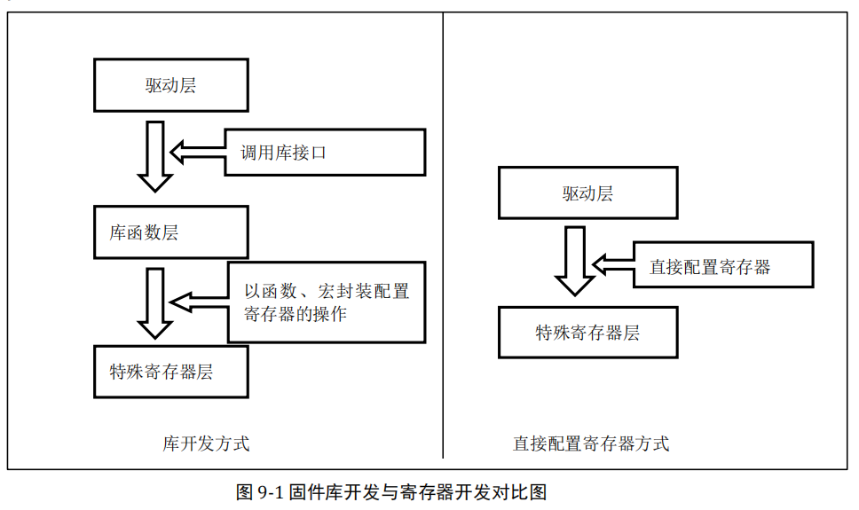

## 08_自己写库-构建库函数雏形(第1节)

实际上，库是架设在寄存器与用户驱动层之间的代码，向下处理与寄存器直接相关的配置，向上为用户提供配置寄存器的接口。



接下来，我们在寄存器点亮 LED 的代码上继续完善，把代码一层层封装，实现库的最初的雏形。

上一章中我们在操作寄存器的时候，操作的是都寄存器的绝对地址，如果每个外设寄存器都这样操作，那将非常麻烦。我们考虑到外设寄存器的地址都是基于外设基地址的**偏移地址**，都是在外设基地址上逐个连续递增的，每个寄存器占 32 个字节，这种方式跟结构 体里面的成员类似。所以我们可以定义一种外设结构体，结构体的地址等于外设的基地址，结构体的成员等于寄存器，成员的排列顺序跟寄存器的顺序一样。这样我们操作寄存器的 时候就不用每次都找到绝对地址，只要知道外设的基地址就可以操作外设的全部寄存器，即操作结构体的成员即可。 

**封装寄存器列表**

```c
#define  GPIOB_BASE              (APB2PERIPH_BASE + 0x0C00)
typedef unsigned int 		uint32_t;
typedef unsigned short 		uint16_t;

typedef struct
{
	uint32_t CRL;
	uint32_t CRH;
	uint32_t IDR;
	uint32_t ODR;
	uint32_t BSRR;
	uint32_t BRR;
	uint32_t LCKR;
}GPIO_TypeDef;

#define GPIOB 	((GPIO_TypeDef*)GPIOB_BASE)     //这里的最外层的括号是要加上的。
```

**控制红灯亮**

```c
RCC_APB2ENR |=(1<<3);
GPIOB->BRR |=(1<<(5));
GPIOB->CRL &=~((0x0f)<<(4*5));
GPIOB->CRL |=(1<<(4*5));
```

