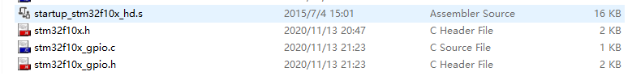

## 8..08_自己写库-构建库函数雏形(第2节)

1. 我们把针对GPIO外设操作的函数及其宏定义分别存放在 “ stm32f10x_gpio.c ” 和 “stm32f10x_gpio.h”文件中，这两个文件需要自己新建。

   

   创建好文件夹之后，在keil中双击文件夹将`stm32f10x_gpio.c`添加。

   在`stm32f10x_gpio.c`中写入

   ```c
   #include "stm32f10x_gpio.h"
   ```

   再编译文件，之后就能看到`stm32f10x_gpio.c`下有	`stm32f10x_gpio.h`头文件了。

2. 在`stm32f10x_gpio.h`头文件写入

   ```c
   #ifndef __STM32F10X_GPIO_H  //防重复
   
   #define __STM32F10X_GPIO_H
   #include "stm32f10x.h"   //因为要使用到寄存器定义，所以要把这个头文件给包含进来。
   
   #endif /* __STM32F10X_GPIO_H*/
   
   ```

   我们需要在`stm32f10x_gpio.c`写一些函数，这些函数的声明都放在`stm32f10x_gpio.h`头文件当中。

3. 在main函数中要调用我们所写的函数，所以在mian函数中要将对应的头文件包含进来。

   在main中加入头文件。

   ```c
   #include "stm32f10x_gpio.h"
   ```

   编译之后可能会出现`invalid redeclaration of type name xxxxxx`的错误，这错误的意思的就是重复声明了。

   原因：在`stm32f10x_gpio.h`中也声明了`stm32f10x.h`,重复定义了。

   解决办法：

   在头文件中加入

   ```c
   #ifndef __头文件名 //防重复
   
   #endif /* __头文件名*/
   ```

   以后养成习惯，每个头文件中都写上这东西。

4. 定义端口的置位和复位函数

   在`stm32f10x_gpio.c`中写入

   ```c++
   #include "stm32f10x_gpio.h"
   
   /**
   *函数功能：设置引脚为高电平
   *参数说明：GPIOx:该参数为 GPIO_TypeDef 类型的指针，指向 GPIO 端口的地址
   *GPIO_Pin:选择要设置的 GPIO 端口引脚，可输入宏 GPIO_Pin_0-15，
   *表示 GPIOx 端口的 0-15 号引脚。
   */
   void GPIO_SetBits(GPIO_TypeDef *GPIOx,uint16_t GPIO_Pin)
   {
   	GPIOx->BSRR |=GPIO_Pin;
   }
   
   /**
   *函数功能：设置引脚为低电平
   *参数说明：GPIOx:该参数为 GPIO_TypeDef 类型的指针，指向 GPIO 端口的地址
   * GPIO_Pin:选择要设置的 GPIO 端口引脚，可输入宏 GPIO_Pin_0-15，
   * 表示 GPIOx 端口的 0-15 号引脚。
   */
   void GPIO_ResetBits(GPIO_TypeDef *GPIOx,uint16_t GPIO_Pin)
   {
   	GPIOx->BRR |=GPIO_Pin;
   }
   
   ```

   在`stm32f10x_gpio.h`中写入

   ```c
   /*GPIO 引脚号定义*/
   #define GPIO_Pin_0 ((uint16_t)0x0001) /*!< 选择 Pin0 (1<<0) */
   #define GPIO_Pin_1 ((uint16_t)0x0002) /*!< 选择 Pin1 (1<<1)*/
   #define GPIO_Pin_2 ((uint16_t)0x0004) /*!< 选择 Pin2 (1<<2)*/
   #define GPIO_Pin_3 ((uint16_t)0x0008) /*!< 选择 Pin3 (1<<3)*/
   #define GPIO_Pin_4 ((uint16_t)0x0010) /*!< 选择 Pin4 */
   #define GPIO_Pin_5 ((uint16_t)0x0020) /*!< 选择 Pin5 */
   #define GPIO_Pin_6 ((uint16_t)0x0040) /*!< 选择 Pin6 */
   #define GPIO_Pin_7 ((uint16_t)0x0080) /*!< 选择 Pin7 */
   #define GPIO_Pin_8 ((uint16_t)0x0100) /*!< 选择 Pin8 */
   #define GPIO_Pin_9 ((uint16_t)0x0200) /*!< 选择 Pin9 */
   #define GPIO_Pin_10 ((uint16_t)0x0400) /*!< 选择 Pin10 */
   #define GPIO_Pin_11 ((uint16_t)0x0800) /*!< 选择 Pin11 */
   #define GPIO_Pin_12 ((uint16_t)0x1000) /*!< 选择 Pin12 */
   #define GPIO_Pin_13 ((uint16_t)0x2000) /*!< 选择 Pin13 */
   #define GPIO_Pin_14 ((uint16_t)0x4000) /*!< 选择 Pin14 */
   #define GPIO_Pin_15 ((uint16_t)0x8000) /*!< 选择 Pin15 */
   #define GPIO_Pin_All ((uint16_t)0xFFFF) /*!< 选择全部引脚 */
   
   
   void GPIO_SetBits(GPIO_TypeDef *GPIOx,uint16_t GPIO_Pin);
   void GPIO_ResetBits(GPIO_TypeDef *GPIOx,uint16_t GPIO_Pin);
   ```

5. 测试

   ```c
   #if 1
   	
   	RCC->APB2ENR |=(1<<3);//打开端口时钟
   	GPIOB->CRL &=~((0x0f)<<(4*0));//配置IO口为输出
   	GPIOB->CRL |=(1<<(4*0));
   	
   //	GPIO_SetBits(GPIOB,GPIO_Pin_0);
   	GPIO_ResetBits(GPIOB,GPIO_Pin_0);
   #endif
   ```
