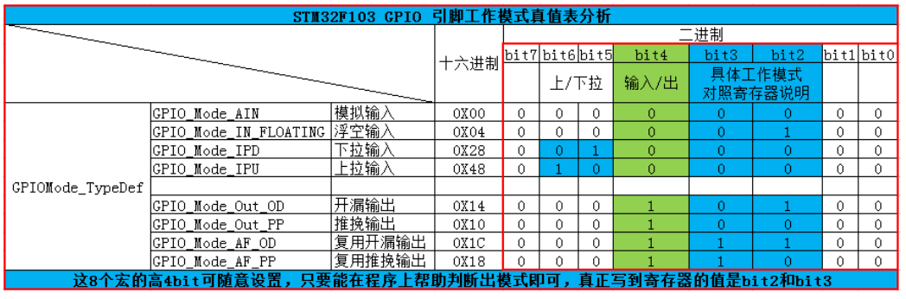

## 08_自己写库-构建库函数雏形(第3节)

在第二节中输出电平的代码得到了简化，但是在控制GPIO输出电平前还需要初始化GPIO引脚的各种模式，这部分代码涉及的寄存器有很多，我们希望初始化GPIO也能以如此简单的方法去实现。接下来就是初始化GPIO:

1. 首先声明一个名为GPIO_InitTypeDef 的结构体类型

   在`stm32f10x_gpio.h`头文件写入

   ```c
   //定义 GPIO 初始化结构体
   typedef struct
   {
   	uint16_t GPIO_Pin; /*!< 选择要配置的 GPIO 引脚 */
   
   	uint16_t GPIO_Speed; /*!< 选择 GPIO 引脚的速率 */
    
   	uint16_t GPIO_Mode; /*!< 选择 GPIO 引脚的工作模式 */
   } GPIO_InitTypeDef;
   ```

   这个结构体中包含了初始化 GPIO所需要的信息，包括引脚号、工作模式、输出速率。设计这个结构体的思路是：初始化 GPIO 前，先定义一个这样的结构体变量，根据需要配 置 GPIO 的模式，对这个结构体的各个成员进行赋值，**然后把这个变量作为“GPIO 初始化 函数”的输入参数**，该函数能根据这个变量值中的内容去配置寄存器，从而实现 GPIO 的初始化。

2. 定义引脚模式的枚举类型

   在`stm32f10x_gpio.h`头文件写入

   **GPIO 输出速率枚举定义**

   ```c
   typedef enum
   { 
     GPIO_Speed_10MHz = 1,         // 10MHZ        (01)b
     GPIO_Speed_2MHz,              // 2MHZ         (10)b
     GPIO_Speed_50MHz              // 50MHZ        (11)b
   }GPIOSpeed_TypeDef;
   ```

    **GPIO 工作模式枚举定义**

   ```c
   typedef enum
   { GPIO_Mode_AIN = 0x0,           // 模拟输入     (0000 0000)b
     GPIO_Mode_IN_FLOATING = 0x04,  // 浮空输入     (0000 0100)b
     GPIO_Mode_IPD = 0x28,          // 下拉输入     (0010 1000)b
     GPIO_Mode_IPU = 0x48,          // 上拉输入     (0100 1000)b
     
     GPIO_Mode_Out_OD = 0x14,       // 开漏输出     (0001 0100)b
     GPIO_Mode_Out_PP = 0x10,       // 推挽输出     (0001 0000)b
     GPIO_Mode_AF_OD = 0x1C,        // 复用开漏输出 (0001 1100)b
     GPIO_Mode_AF_PP = 0x18         // 复用推挽输出 (0001 1000)b
   }GPIOMode_TypeDef;
   
   ```

   这里的工作模式的定义的理解很重要。

   

   1. bit0,bit1:对应MODE，是速率，因为速率是单独抽离出来的（前面定义的枚举类型），所以这里不初始化。
   2. bit2,bit3:对应CNF
   3. bit4:区分输入还是输出。1表示输出，0表示输入。
   4. bit5,bit6:控制的是上拉输入，还是下拉输入。

3. 定义GPIO初始化函数

   接着前面的思路，对初始化结构体赋值后，把它输入到 GPIO 初始化函数，由它来实现寄存器配置。

   在`stm32f10x_gpio.c`中写入

   都是在.c文件中函数，在头文件中写桉树的声明，定义结构体之类的。

   ```c
   void GPIO_Init(GPIO_TypeDef* GPIOx, GPIO_InitTypeDef* GPIO_InitStruct)
   {
     uint32_t currentmode = 0x00, currentpin = 0x00, pinpos = 0x00, pos = 0x00;
     uint32_t tmpreg = 0x00, pinmask = 0x00;
     
   /*---------------------- GPIO 模式配置 --------------------------*/
     // 把输入参数GPIO_Mode的低四位暂存在currentmode
     currentmode = ((uint32_t)GPIO_InitStruct->GPIO_Mode) & ((uint32_t)0x0F);
   	
     // bit4是1表示输出，bit4是0则是输入 
     // 判断bit4是1还是0，即首选判断是输入还是输出模式
     if ((((uint32_t)GPIO_InitStruct->GPIO_Mode) & ((uint32_t)0x10)) != 0x00)
     { 
   	// 输出模式则要设置输出速度
       currentmode |= (uint32_t)GPIO_InitStruct->GPIO_Speed;
     }
   /*-------------GPIO CRL 寄存器配置 CRL寄存器控制着低8位IO- -------*/
     // 配置端口低8位，即Pin0~Pin7
     if (((uint32_t)GPIO_InitStruct->GPIO_Pin & ((uint32_t)0x00FF)) != 0x00)
     {
   	// 先备份CRL寄存器的值
       tmpreg = GPIOx->CRL;
   		
   	// 循环，从Pin0开始配对，找出具体的Pin
       for (pinpos = 0x00; pinpos < 0x08; pinpos++)
       {
   	 // pos的值为1左移pinpos位
         pos = ((uint32_t)0x01) << pinpos;
         
   	  // 令pos与输入参数GPIO_PIN作位与运算，为下面的判断作准备
         currentpin = (GPIO_InitStruct->GPIO_Pin) & pos;
   			
   	  //若currentpin=pos,则找到使用的引脚
         if (currentpin == pos)
         {
   		// pinpos的值左移两位（乘以4），因为寄存器中4个寄存器位配置一个引脚
           pos = pinpos << 2;
          //把控制这个引脚的4个寄存器位清零，其它寄存器位不变
           pinmask = ((uint32_t)0x0F) << pos;
           tmpreg &= ~pinmask;
   				
           // 向寄存器写入将要配置的引脚的模式
           tmpreg |= (currentmode << pos);  
   				
   		// 判断是否为下拉输入模式
           if (GPIO_InitStruct->GPIO_Mode == GPIO_Mode_IPD)
           {
   		  // 下拉输入模式，引脚默认置0，对BRR寄存器写1可对引脚置0
             GPIOx->BRR = (((uint32_t)0x01) << pinpos);
           }				
           else
           {
             // 判断是否为上拉输入模式
             if (GPIO_InitStruct->GPIO_Mode == GPIO_Mode_IPU)
             {
   		    // 上拉输入模式，引脚默认值为1，对BSRR寄存器写1可对引脚置1
               GPIOx->BSRR = (((uint32_t)0x01) << pinpos);
             }
           }
         }
       }
   		// 把前面处理后的暂存值写入到CRL寄存器之中
       GPIOx->CRL = tmpreg;
     }
   /*-------------GPIO CRH 寄存器配置 CRH寄存器控制着高8位IO- -----------*/
     // 配置端口高8位，即Pin8~Pin15
     if (GPIO_InitStruct->GPIO_Pin > 0x00FF)
     {
   		// // 先备份CRH寄存器的值
       tmpreg = GPIOx->CRH;
   		
   	// 循环，从Pin8开始配对，找出具体的Pin
       for (pinpos = 0x00; pinpos < 0x08; pinpos++)
       {
         pos = (((uint32_t)0x01) << (pinpos + 0x08));
   			
         // pos与输入参数GPIO_PIN作位与运算
         currentpin = ((GPIO_InitStruct->GPIO_Pin) & pos);
   			
   	 //若currentpin=pos,则找到使用的引脚
         if (currentpin == pos)
         {
   		//pinpos的值左移两位（乘以4），因为寄存器中4个寄存器位配置一个引脚
           pos = pinpos << 2;
           
   	    //把控制这个引脚的4个寄存器位清零，其它寄存器位不变
           pinmask = ((uint32_t)0x0F) << pos;
           tmpreg &= ~pinmask;
   				
           // 向寄存器写入将要配置的引脚的模式
           tmpreg |= (currentmode << pos);
           
   		// 判断是否为下拉输入模式
           if (GPIO_InitStruct->GPIO_Mode == GPIO_Mode_IPD)
           {
   		  // 下拉输入模式，引脚默认置0，对BRR寄存器写1可对引脚置0
             GPIOx->BRR = (((uint32_t)0x01) << (pinpos + 0x08));
           }
            // 判断是否为上拉输入模式
           if (GPIO_InitStruct->GPIO_Mode == GPIO_Mode_IPU)
           {
   		  // 上拉输入模式，引脚默认值为1，对BSRR寄存器写1可对引脚置1
             GPIOx->BSRR = (((uint32_t)0x01) << (pinpos + 0x08));
           }
         }
       }
   	// 把前面处理后的暂存值写入到CRH寄存器之中
       GPIOx->CRH = tmpreg;
     }
   }
   ```

   之后还需要再`stm32f10x_gpio.h`中声明函数

   ```c
   void GPIO_Init(GPIO_TypeDef* GPIOx, GPIO_InitTypeDef* GPIO_InitStruct)；
   ```

4. 点亮小灯

   回到main函数中

   ```C
   	GPIO_InitTypeDef GPIO_InitStructure;//这里需要注意定义变量必须在最前面。
   	RCC->APB2ENR |=(1<<3);//打开端口时钟
   	
   	GPIO_InitStructure.GPIO_Pin=GPIO_Pin_5;//定义引脚
   	GPIO_InitStructure.GPIO_Mode=GPIO_Mode_Out_PP;//定义推挽输出。
   	GPIO_InitStructure.GPIO_Speed=GPIO_Speed_10MHz;//定义输出的速率。
   	//写入寄存器。
   	GPIO_Init(GPIOB, &GPIO_InitStructure);//第一个参数是哪个GPIO端口，第二个是结构体的地址
   ```

5. 理解GPIO_Init函数
