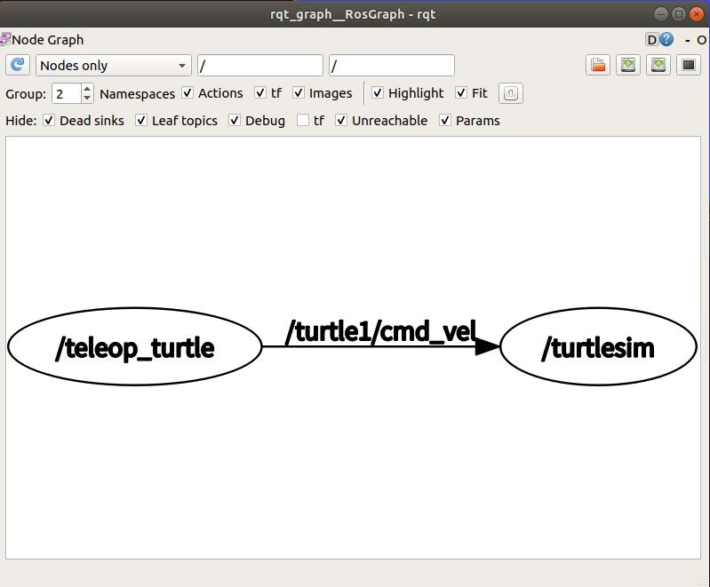
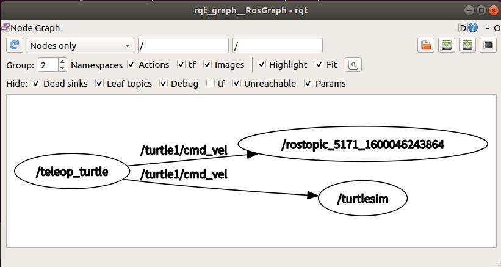

## [02_理解ROS话题](http://wiki.ros.org/cn/ROS/Tutorials/UnderstandingTopics)

### 1.通过键盘控制小乌龟

​	在三个终端运行三个命令，每个终端运行一条命令。

```
$ roscore
$ rosrun turtlesim turtlesim_node
$ rosrun turtlesim turtle_teleop_key
```

​	选中`turtle_teleop_key`所在的终端窗口以确保你的按键输入能被捕获。

### 2.ROS Topics

​	`turtlesim_node`节点和`turtle_teleop_key`节点之间是通过一个ROS**话题**来互相通信的。

​	`turtle_teleop_key`在一个话题上**发布**按键输入消息，而`turtlesim`则**订阅**该话题以接收该消息。

​	下面让我们使用[rqt_graph](http://wiki.ros.org/rqt_graph)来显示当前运行的节点和话题。

```
$ rosrun rqt_graph rqt_graph
```



​	`turtlesim_node`和`turtle_teleop_key`节点正通过一个名为 `/turtle1/cmd_vel`的话题来互相通信。

### 3.rostopic介绍

​	`rostopic`命令工具能让你获取有关ROS话题的信息。

```
rostopic bw     display bandwidth used by topic
rostopic echo   print messages to screen
rostopic hz     display publishing rate of topic
rostopic list   print information about active topics
rostopic pub    publish data to topic
rostopic type   print topic type
```

#### 	3.1使用rostopic echo

#### 		`rostopic echo`可以显示在某个话题上发布的数据。

```
rostopic echo [topic]
```

```
$ rostopic echo /turtle1/cmd_vel
```

​		这时，再去控制小乌龟移动，我们就能看到一些移动数据了。

​		再运行：

```
$ rosrun rqt_graph rqt_graph
```

​		`rostopic echo`现在也订阅了`turtle1/cmd_vel`话题。



#### 	3.2使用rostopic list

​		`rostopic list`能够列出所有当前订阅和发布的话题。

```
Usage: rostopic list [/topic]

Options:
  -h, --help            show this help message and exit
  -b BAGFILE, --bag=BAGFILE
                        list topics in .bag file
  -v, --verbose         list full details about each topic
  -p                    list only publishers
  -s                    list only subscribers
```

```
$ rostopic list -v
这会显示出有关所发布和订阅的话题及其类型的详细信息。

Published topics:
 * /turtle1/color_sensor [turtlesim/Color] 1 publisher
 * /turtle1/command_velocity [turtlesim/Velocity] 1 publisher
 * /rosout [roslib/Log] 2 publishers
 * /rosout_agg [roslib/Log] 1 publisher
 * /turtle1/pose [turtlesim/Pose] 1 publisher

Subscribed topics:
 * /turtle1/command_velocity [turtlesim/Velocity] 1 subscriber
 * /rosout [roslib/Log] 1 subscriber
```

### 4.ROS Message

​	话题之间的通信是通过在节点之间发送ROS**消息**实现的。对于发布器(`turtle_teleop_key`)和订阅器(`turtulesim_node`)之间的通信，发布器和订阅器之间必须发送和接收相同**类型**的消息。这意味着话题的**类型**是由发布在它上面的消息**类型**决定的。使用`rostopic type`命令可以查看发布在某个话题上的消息**类型**。

#### 	4.1使用rostopic type

​		`rostopic type` 命令用来查看所发布话题的消息类型。

```
$ rostopic type /turtle1/cmd_vel

geometry_msgs/Twist

我们可以使用rosmsg命令来查看消息的详细情况
$ rosmsg show geometry_msgs/Twist
geometry_msgs/Vector3 linear
  float64 x
  float64 y
  float64 z
geometry_msgs/Vector3 angular
  float64 x
  float64 y
  float64 z
```

